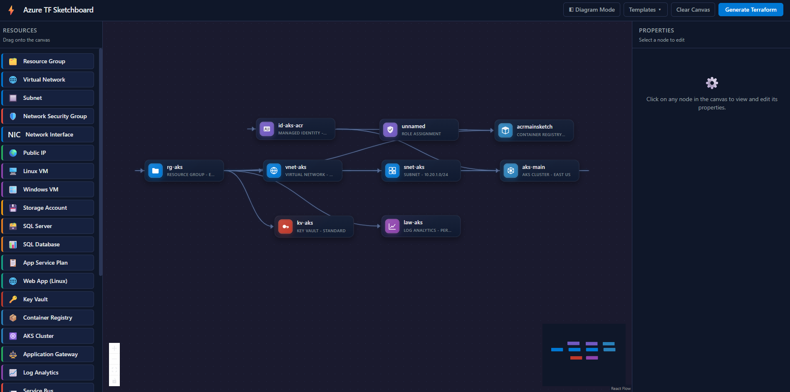
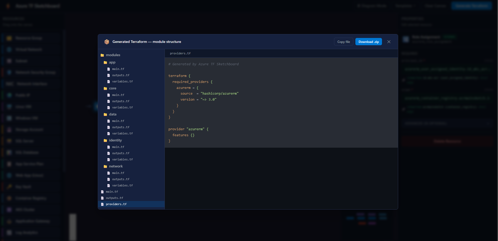

# 🏗️ Azure TF Sketchboard - Drag and Drop Terraform Builder for Azure

[](LICENSE)
[](https://react.dev)
[](https://vitejs.dev)

> **Drag and drop Terraform builder for Azure** — Design your cloud infrastructure visually, get production-ready Terraform code.

Azure TF Sketchboard is a browser-based visual IDE for building Azure infrastructure-as-code. Drag Azure resources onto a canvas, connect them to model dependencies, configure properties, and instantly generate multi-file Terraform modules ready to deploy.



## ✨ What You Can Do

- 🎨 **Drag-and-Drop Canvas**: Visually design Azure architecture with 21+ resource types
- 🔗 **Smart Connections**: Link resources to auto-populate Terraform references
- ⚙️ **Schema-Driven Forms**: Edit required and optional AzureRM properties with validation
- 📝 **Instant Terraform Generation**: Create multi-file module structures with one click
- 📦 **Download Projects**: Export complete Terraform projects as ZIP files
- 🔍 **Live Preview**: Edit and export properties in real-time



## 🚀 Quick Start

### Prerequisites
- Node.js 16+ and npm

### Installation

```bash
git clone https://github.com/yourusername/azure-tf-sketchboard.git
cd azure-tf-sketchboard
npm install
```

### Run Locally

```bash
npm run dev
```

Open your browser to the local URL (typically `http://localhost:5173`).

### Build for Production

```bash
npm run build
```

### Preview Production Build

```bash
npm run preview
```

## 📖 Basic Workflow

1. **Drag Resources**: Select Azure resources from the left palette
2. **Place on Canvas**: Drop them onto the design canvas
3. **Connect Dependencies**: Draw edges between related resources
4. **Configure Properties**: Edit resource settings in the right panel
5. **Generate**: Click "Generate Terraform" button
6. **Export**: Download the complete project as a ZIP

## 🔧 How to Run

### Development Server

Start the development server:

```bash
npm run dev
```

The application will be available at `http://localhost:5173`. Hot-reload is enabled for instant feedback during development.

### Production Build

Create an optimized production build:

```bash
npm run build
```

Output files are in the `dist/` directory. Ready for deployment to any static hosting service (Vercel, Netlify, GitHub Pages, Azure Static Web Apps, etc.).

### Preview Before Deployment

Preview the production build locally:

```bash
npm run preview
```

## Connection Examples

Connections are intentionally simple. Direction does not matter for most relationships; the generator reads the graph and fills relevant Terraform fields.

Common patterns:

```text
Resource Group -> Virtual Network -> Subnet
```

```text
Resource Group -> Public IP -> Network Interface -> Virtual Machine
```

```text
Subnet -> Network Interface -> Virtual Machine
```

```text
App Service Plan -> Linux Web App
```

```text
SQL Server -> SQL Database
```

## VM, NIC, Subnet, and Public IP

For Azure virtual machines, the correct Terraform model is:

```text
Virtual Machine -> Network Interface -> Subnet
Network Interface -> Public IP
```

If you add a Network Interface node, the VM automatically uses its ID:

```hcl
network_interface_ids = var.vm_main_network_interface_ids
```

If you skip the Network Interface node and connect a VM directly to a Subnet, the generator creates a fallback NIC for that VM. If a Public IP is also connected to the VM, that fallback NIC receives the public IP too.

Recommended diagram:

```text
Resource Group
  -> Virtual Network
  -> Subnet
  -> Network Interface
  -> Virtual Machine

Resource Group
  -> Public IP
  -> Network Interface
```

## Generated Terraform Structure

The ZIP contains root files plus grouped feature modules:

```text
azure-terraform.zip
├── providers.tf
├── main.tf
├── outputs.tf
└── modules/
    ├── core/
    │   ├── main.tf
    │   ├── variables.tf
    │   └── outputs.tf
    ├── network/
    │   ├── main.tf
    │   ├── variables.tf
    │   └── outputs.tf
    ├── vm/
    │   ├── main.tf
    │   ├── variables.tf
    │   └── outputs.tf
    ├── app/
    │   ├── main.tf
    │   ├── variables.tf
    │   └── outputs.tf
    └── data/
        ├── main.tf
        ├── variables.tf
        └── outputs.tf
```

The root `main.tf` calls grouped modules. Individual resources are placed inside the module that best matches their role:

- `core`: resource groups
- `network`: VNets, subnets, NICs, public IPs, gateways, CDN
- `vm`: Linux and Windows virtual machines
- `app`: app services, AKS, container registry
- `data`: storage, SQL, Cosmos DB, Key Vault, logs, messaging

## Supported Azure Resources

The app currently supports these AzureRM resources:

- Resource Group
- Virtual Network
- Subnet
- Network Security Group
- Network Interface
- Public IP
- Linux Virtual Machine
- Windows Virtual Machine
- Storage Account
- SQL Server
- SQL Database
- App Service Plan
- Linux Web App
- Key Vault
- Container Registry
- Kubernetes Cluster
- Application Gateway
- Log Analytics Workspace
- Service Bus Namespace
- Cosmos DB Account
- CDN Profile

## How Auto-Wiring Works

The generator uses resource connections to populate Terraform references. For example:

- A VNet connected to a Resource Group receives `resource_group_name`.
- A Subnet connected to a VNet receives `virtual_network_name`.
- A NIC connected to a Subnet receives `ip_configuration.subnet_id`.
- A NIC connected to a Public IP receives `ip_configuration.public_ip_address_id`.
- A VM connected to a NIC receives `network_interface_ids`.
- A Web App connected to an App Service Plan receives `service_plan_id`.
- A SQL Database connected to a SQL Server receives `server_id`.

Some dependencies can be found transitively. For example, if a Subnet is connected to a VNet and the VNet is connected to a Resource Group, the Subnet can inherit the Resource Group through that path.

## Before Applying Terraform

Generated Terraform is a strong starting point, but you should still review it before applying:

- Replace placeholder passwords and tenant IDs.
- Confirm names meet Azure naming rules.
- Confirm locations, SKUs, and address ranges.
- Run `terraform fmt`.
- Run `terraform init`.
- Run `terraform validate`.
- Run `terraform plan` before `terraform apply`.


## 📁 Project Structure

```
src/
├── components/           # React components (Palette, Canvas, etc.)
├── data/                 # Edge maps and resource definitions
├── schema/               # AzureRM resource schemas
├── utils/                # Generators and resolvers
├── App.jsx
├── store.js              # Zustand store
└── main.jsx
```

## ⚠️ Disclaimers

**Review Required**: Generated Terraform is a starting point. Always review code, test in non-production first, and run `terraform plan` before applying.

**Security**: Replace placeholder credentials immediately. Use Azure Key Vault for sensitive data. Don't commit `.tfvars` files.

**Limitations**: Not all AzureRM resources are supported. Complex configurations may require manual adjustment.

**Costs**: Generated resources incur Azure costs. Run `terraform plan` to review pricing.

## 🤖 AI-Assisted Development

This project uses **AI for code generation and documentation**. All code has been reviewed and tested. Always validate generated Terraform against your requirements before deploying.

## 📄 License

**MIT License** — Free to use commercially, modify, and distribute. See [LICENSE](LICENSE) for details.

## 🤝 Contributing

1. Fork the repository
2. Create a feature branch (`git checkout -b feature/your-feature`)
3. Commit changes (`git commit -m 'Add feature'`)
4. Push and open a Pull Request

## 📧 Support

- [Open a GitHub Issue](https://github.com/yourusername/azure-tf-sketchboard/issues)
- Check [OVERVIEW.md](OVERVIEW.md) for details

---

**Happy Infrastructure Coding! 🚀**
